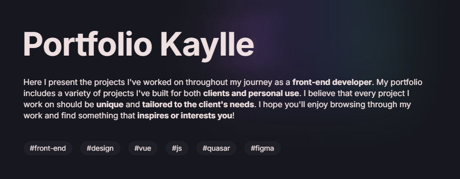
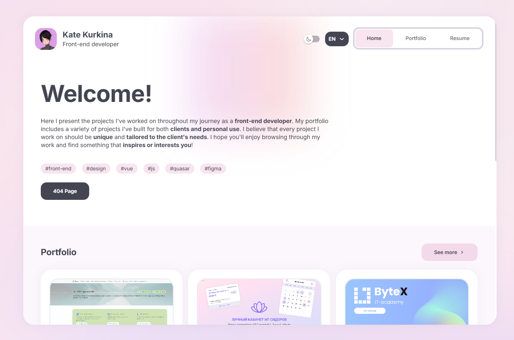
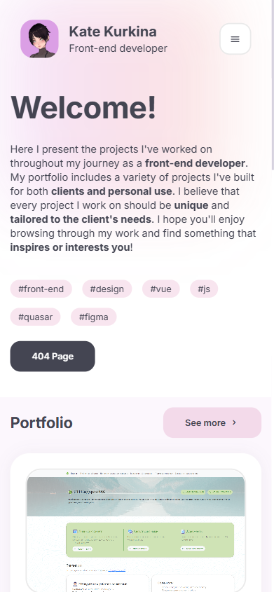

> ✨ A personal developer portfolio built with Vue 3, Quasar, and TypeScript. Clean, minimalist, and multilingual.

---

## 📸 Preview

| Desktop | Mobile |
|--------|--------|
|  |  |

---

## 🚀 Tech Stack

- ⚙️ **Vue 3 + Composition API**
- 💠 **Quasar + Vite**
- 🌐 **Vue I18n** — multilingual support
- 🧪 **Vitest** — unit testing
- ✨ **TypeScript**, ESLint & Prettier

---

## 🛠️ Installation

```bash
npm install
# or
yarn
```

---

## 🔧 Developer Commands

| Command          | Description                    |
|------------------|--------------------------------|
| quasar dev       | Start development server       |
| quasar build     | Build the app for production   |
| npm run lint     | Lint source code               |
| npm run format   | Format source files            |
| vitest           | Run unit tests (if using Vitest CLI) |

---

## ✅ Testing

Unit tests are written using [Vitest](https://vitest.dev/). You can find them in `src/tests/unit`.

---

## 🌍 Localization (i18n)

This project supports multiple languages using Vue I18n. Translations are stored in src/i18n.

---

## 📁 Project Structure

- public/

  └── icons/

  └── images/

  └── screenshots/ → Screenshots for README and documentation

  └── svg/

- src/

  ├── boot/

  ├── components/

  ├── css/

  ├── i18n/

  ├── layouts/

  ├── pages/

  ├── router/

  ├── tests/unit/ → Unit tests

  ├── utils/

- quasar.config.ts

- README.md

---

## ✨ Demo

Live Website → http://kaylle.github.io/

---

## 📩 Contact

Feel free to reach out if you’re a recruiter:

[📧kaylle@yandex.ru](mailto:kaylle@yandex.ru)

---

## 📝 License

MIT © [Kaylle](https://github.com/kaylle)

